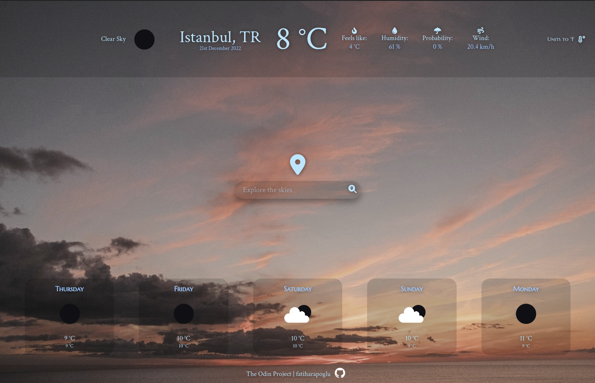

# Weather API

Created with **HTML**, **SCSS** and **JavaScript**.

⮕ [Live preview](https://fatiharapoglu.github.io/weather/)

## Features

-   Display 5 days of forecast data for a given location
-   Snowflake loading screen with blurry background
-   Display temperature in Celsius or Fahrenheit units
-   Geolocation API support, which is for browser to find where the user are and show weather for the location
-   Unique weather symbols for each forecast description

## Helper Dependencies

-   [Webpack](https://webpack.js.org/) for bundling
-   [FontAwesome](https://fontawesome.com/) Icons
-   [date-fns](https://date-fns.org/) for formatting and manipulating dates
-   [Sass](https://sass-lang.com/) for SCSS
-   [Eslint](https://eslint.org/) for linting
-   [Prettier](https://prettier.io/) for formatting

## Roadmap

-   Make design responsive.

## Acknowledgements

-   [OpenWeatherMap](https://openweathermap.org/) (Weather API provider)

## How It Looks

